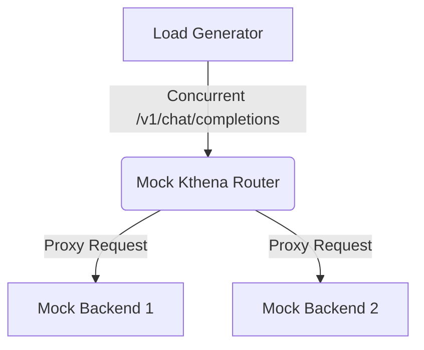

# Kthena Router Benchmarking PoC

This is a MINIMAL but WORKING Proof of Concept (PoC) for benchmarking the LLM routing performance of Kthena Router.

## Architecture

The PoC simulates a realistic LLM traffic scenario by sending concurrent API requests to the Kthena Router, which intelligently routes them to mock backend servers.



## Setup Instructions

Ensure you have Docker and Docker Compose installed.

1. Navigate to the `bench` directory:
   ```bash
   cd bench
   ```

2. Start the services (Kthena Router, Mock Backends, Prometheus, and Grafana):
   ```bash
   docker compose up -d
   ```

3. Verify that the services are running:
   ```bash
   docker compose ps
   ```

4. View the live Grafana dashboard at `http://localhost:3000/d/kthena-bench` (Default login: admin/admin).

## How to Run Benchmarks

The Load Generator is a Go program that sends concurrent requests to the Kthena Router. It can be run using the `docker compose run` command with different configurations. 

Run a specific scenario (e.g., low-qps):
```bash
docker compose run --rm loadgen ./loadgen --qps 5 --concurrency 2 --requests 50 --prompt-size 100 --url http://kthena-router:8080/v1/chat/completions --out /app/results
```

Alternatively, you can build and run the load generator locally if you have Go installed:
```bash
cd bench/loadgen
go run main.go --qps 20 --concurrency 10 --requests 200 --url http://localhost:8080/v1/chat/completions --out ../results
```

### Scenario Configurations
We provide a set of YAML files in `bench/scenarios/` with recommended parameters:
- **low-qps.yaml**: `qps=5`, `concurrency=2`, `requests=50`
- **medium-qps.yaml**: `qps=20`, `concurrency=10`, `requests=200`
- **burst.yaml**: `qps=100`, `concurrency=50`, `requests=500`

## Example Output

After running the benchmark, the results are exported to `bench/results/results.json`:

```json
{
  "qps": 20,
  "avg_latency_ms": 125.4,
  "p95_latency_ms": 185.2,
  "ttft_ms": 42.1,
  "throughput_rps": 19.8,
  "errors": 0
}
```

## Explanation of Metrics

- **TTFT (Time To First Token)**: The time elapsed between sending the request and receiving the first streamed token from the LLM backend. This is a critical metric for user experience in chat applications, as it determines how fast the AI "starts typing."
- **Latency**: The total time taken to receive the complete response (all tokens).
- **Throughput**: The actual number of requests successfully completed per second.

## Future Improvements

1. **Kubernetes Integration**: Deploy the router and mock backends to a real Kubernetes cluster (e.g., kind or k3s) and utilize true `ModelRoute` and `ModelServer` CRDs for advanced routing strategies.
2. **Variable Token Generation**: Instead of a fixed response, modify the mock backends to stream a random or probabilistically distributed number of tokens to simulate real-world variance.
3. **Weighted Routing**: Implement advanced load balancing (e.g., Least Outstanding Requests) and evaluate how Kthena balances traffic when backends have varying response times.
